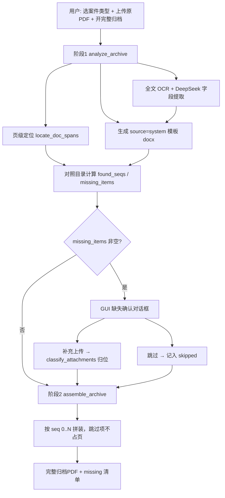

# 案件归档系统 V4 升级 PRD（面向 Claude Code 循环开发）

> **文档版本：V3.1（二轮验收 + Phase C）**
> **更新日期：2026-06-09**
> **适用代码库：** `f:\GD`
> **目标版本：** V4
> **权威路径：** `f:\GD\docs\PRD_V4.md`

---

## 文档导读（30 秒读懂）

| 层级 | 内容 |
|------|------|
| **核心目标** | 个案模式：按五类标准案卷目录，识别原 PDF 材料 → 缺失人工确认 → 拼装完整归档 PDF |
| **当前阶段** | Phase B 已勾选；**二轮验收未全过** → 本轮 Loop 做 **Phase C**（见第 8 章） |
| **成功判据** | GUI：选类型 + 开完整归档 + 上传 PDF → 缺失确认 → 下载完整归档 PDF；批量模式不变 |
| **边界** | 批量保持 V3；个案完整归档支持路径 A（单卷）与路径 B（多文件）；必须人工确认缺失 |

---

## 0. 已锁定决策记录（开发不得偏离）

| # | 决策 | 结论 |
|---|------|------|
| D1 | 五类目录数据 | 民事=行政逐字相同；数据见第 10 章 |
| D2 | 档案卷宗 | **序号 0 封面置顶**，系统生成模板 `档案卷宗` |
| D3 | 委托人须知 | **不新建模板**，并入 `质量监督卡` |
| D4 | 手动材料 | **先在原 PDF 中识别**（有锚点的可 OCR）；识别不到 → 缺失清单 → 用户补充/跳过 |
| D5 | 缺失/跳过项 | **不插占位页**；**原 PDF 全部页面必须出现在最终 PDF（每页恰好一次）**；跳过仅表示用户不补传，**不阻止已识别文书的插入** |
| D6 | 完整归档范围 | **仅个案模式**；批量保持 V3（5 份 docx） |
| D7 | 两阶段流程 | `analyze_archive`（阶段1）→ GUI 缺失确认 → `assemble_archive`（阶段2） |
| D8 | 页级 OCR | 用途限定为 **文书切分（首页锚点）**，而非逐页分类；文字层优先 → RapidOCR（rapidocr 默认） |
| D9 | 全文 OCR | 仍用 `config.ocr.engine`（baidu / mineru / mineru_api） |
| D10 | 技术路线 | 复用 `document_segmenter` 锚点；合并用 `docx_to_pdf` + PyMuPDF |
| D11 | Git | loop **不自动 commit/push** |
| D12 | 混合项 | `source=mixed` **分项判定**：PDF 子项与 manual 子项分别核对，任一命中即该项不算缺失 |
| D13 | 补充附件 | 用户上传的文件须经 `attachment_classifier` 归位；认不出 → `evidence` |
| D14 | 文书单元 DocumentUnit | 原 PDF 由多份扫描文书组成；**切分与移动粒度为整份文书**（连续页段），文书内页序不可打乱 |
| D15 | 未分类文书 | OCR 无法匹配目录项的 **整份文书** → 归入该案型「证据材料」目录项（民事 seq7）；多份未分类按原 PDF 顺序 |
| D16 | 同槽多文书 | 同一 catalog seq 可包含多份 DocumentUnit；插入顺序 = 原 PDF 中 `doc_id` 升序 |

---

## 0.5 首轮 Loop 基线（2026-06-09 验收记录）

> **结论：骨架过 verify，闭环未达成。勿从零重做 Phase A。**

### 已完成（Phase A，仅维护不重写）

| 模块 | 状态 |
|------|------|
| `document_segmenter.py` V4 常量/锚点 | ✅ |
| `archive_catalog.py` 五类目录 | ✅ |
| `page_ocr.py` 分层 OCR 框架（rapidocr 可用） | ✅ |
| `pdf_doc_locator.py` DocSpan 定位 | ✅ |
| `attachment_classifier.py` 分类逻辑 | ✅ 模块存在，**未接入流水线** |
| `archive_pipeline.py` `analyze_archive` / `assemble_archive` | ✅ 函数存在，**逻辑不完整** |
| `pdf_archive_merger.py` 拼装框架 | ✅ **不支持 mixed；附件未分类** |
| `run_archive.py` `--catalog` / `--skip-missing` | ✅ CLI 骨架 |
| `settings.py` `get_page_ocr_engine()` | ✅ |
| `app_version.V4_VERSION` / `AGENTS.md` / `requirements.txt` | ✅ |

### Phase B 已补齐（2026-06-09 二轮前）

- analyze manual/mixed 识别、`MANUAL_KEY_DOC_TYPES`、merger mixed、classify 接入 assemble
- GUI `_run_full_archive` 两阶段骨架、缺失对话框 UI
- `config.json.example` 增 `page_engine`

### 二轮验收仍缺（Phase C 必须补齐）

| 缺口 | 严重度 | 验收项 |
|------|--------|--------|
| GUI「补充上传」是 TODO，选上传仍全部跳过 | 🔴 P0 | AC-05 |
| `classify_attachments` 未知文件返回 `other` 而非 `evidence` | 🔴 P0 | AC-04 |
| CLI 端到端未产出 PDF（`outputs/` 空） | 🔴 P0 | AC-09 |
| `requirements.txt` 与实装不一致（`rapidocr` vs `rapidocr-onnxruntime`；缺 Pillow 等） | 🔴 P0 | AC-11 |
| 无 `install_deps` / `verify_deps` 脚本 | 🟠 P1 | AC-11 |
| GUI 进度条未显示；`_run_full_archive` 未设 `_running` | 🟡 P2 | AC-05 |
| `page_ocr` baidu 页级回退仍是 stub | 🟡 P2 | AC-12 |
| 刑事 appeal/indictment 消歧 | ⚪ 可选 | T-208 |

---

## 0.6 二轮验收记录（2026-06-09，验收人：Cursor）

| AC | 结果 | 说明 |
|----|------|------|
| AC-01 | ✅ | 目录计数与 judgment→seq14 |
| AC-02/03 | ✅ | analyze 内联逻辑已实现（未抽 `compute_found_seqs`） |
| AC-04 | ❌ | `2014-兴泰贸易.pdf` 分类为 `other`，应归 `evidence` |
| AC-05 | ⚠️ | 流程可跑，补充上传未实现（L975 TODO） |
| AC-09 | ❌ | CLI 未产出 `outputs\_verify_archive.pdf` |
| AC-10 | ✅ | `page_engine` + `V4_VERSION` |
| AC-11 | ❌ | 依赖清单/安装脚本缺失 |

**结论：Phase B 勾选过早，`<loop-done>` 不成立。启动 Phase C。**

---

## 1. 核心目标（验收心脏）

在**个案模式**下：

1. 用户选择案件类型（民事/刑事/行政/非诉/顾问），开启「完整归档」，上传 1 个案件 PDF。
2. 系统执行 `analyze_archive`：页级定位 + 字段提取 + 系统模板生成 + 缺失核对。
3. 若存在 `missing_items`，弹出对话框，用户逐项「补充上传」或「跳过」。
4. 系统执行 `assemble_archive`，按目录序号 0..N 拼装**一份**完整归档 PDF。
5. 展示缺失/跳过清单，提供打开/下载完整归档 PDF。

**一句话成功判据：** GUI 完整归档路径可端到端跑通；CLI `--catalog --skip-missing` 可产出 PDF；批量模式行为与 V3 一致。

---

## 2. 完整归档业务流程

### 2.1 端到端流程



### 2.2 手动材料识别规则（D4，T-101 必实现）

`source=manual` 或 `source=mixed` 的目录项，**不能默认进 missing**。

**识别顺序：**

1. 查 `doc_spans` 是否含该项 `doc_types` 中任一类型 → 命中则 `found`。
2. 查 `doc_spans` 是否含该项 `manual_key` 对应 doc_type（见下表）→ 命中则 `found`。
3. 对 `mixed`：PDF 子项与 manual 子项**分别**按 1、2 判定；**任一子项命中即整项 found**。
4. 以上均未命中 → 进入 `missing_items`。

**manual_key → 可 OCR 识别的 doc_type 映射：**

| manual_key | 对应 doc_type（锚点见第 4 章） |
|------------|-------------------------------|
| `invoice` | `invoice` |
| `evidence` | `evidence` |
| `plea` | `plea` |
| `agent_opinion` | `agent_opinion` |
| `review_record` / `group_discussion` / `preservation` / `investigation` / `client_talk` / `legal_work` / `client_intro` / `work_record` / `agreement_status` / `meeting_record` | 无标准锚点，**仅能通过用户补充** |

### 2.3 补充附件归位（D13，T-102 必实现）

用户在缺失对话框「补充上传」的文件：

1. 调用 `classify_attachments(files, case_type, config)`。
2. 按 `catalog_item.seq` 归入 `supplements` 字典。
3. 无法匹配具体 seq 的文件 → 默认归入该案型 `evidence` 对应 seq。
4. 图片（jpg/png）须转单页 PDF 后再插入（可用 fitz 或 Pillow）。

### 2.4 GUI 缺失确认对话框（T-103 必实现）

| 元素 | 说明 |
|------|------|
| 触发时机 | `analyze_archive` 返回 `missing_items` 非空 |
| 列表列 | 序号、目录项名称、状态（未找到） |
| 每行操作 | [补充上传] [跳过] |
| 底部 | [确认并生成归档 PDF] |
| 结果 | 成功后弹窗：页数 + missing 清单 + [打开完整归档 PDF] |

**个案区控件（已有壳，须接线）：** 完整归档开关、案件类型 5 单选、进度条（后台线程更新）。**批量区不改。**

### 2.5 `_start()` 分支规则

```
if 个案模式 and full_archive_enabled:
    路径 A：1 个 default PDF → analyze → (缺失对话框) → assemble
    路径 B：多个 PDF（文件名/类型识别）→ analyze(sources) → assemble
    multi_files 转 DocumentSource 列表，不再拦截多文件
else:
    走现有 V3 process_archive / process_archive_sources（不变）
```

### 2.6 最终 PDF 拼装顺序（民事示例）

```
seq0  档案卷宗（系统模板 docx→pdf）
seq1  立案审批表（系统模板）
seq2  发票回执…（原 PDF 页段 或 用户补充）
...
seq17 结案报告表
（skipped / 未补充：不占页，记入 missing；**已 OCR 识别的对应文书仍整份插入**）
```

### 2.7 文书切分与合并算法（D14，V4 核心）

**切分**（`pdf_doc_locator.segment_documents`）：
1. 页级 OCR 得 `page_texts[]`
2. 有锚点页 = 新 DocumentUnit 起点
3. 两起点之间全部页归属前一份文书
4. MinerU 全文补充漏识别起点
5. 首起点前页 = `unknown` 文书

**映射**（`assign_catalog_seq`）：
1. 每份文书一个 `doc_type`（首页判定）
2. 匹配 catalog → `catalog_seq`；多匹配取 `source=pdf` 优先、seq 较大（如 judgment→seq14）
3. 无匹配 → evidence seq

**合并**（`pdf_archive_merger.build_full_archive`）：
- 按 catalog seq 0..N 遍历
- system 项插 docx→pdf
- 其余插 `catalog_seq` 匹配的全部 DocumentUnit（`insert_pdf(from,to)` 整段）
- 验收：`original_pages_included == 原 PDF 页数`

---

## 3. 范围与非目标

### 3.1 本轮必须实现（Phase B）

- T-101：`analyze_archive` 手动/mixed 识别补全
- T-102：merger mixed 拼装 + 附件分类接入 + 图片转 PDF
- T-103：GUI 两阶段完整归档闭环
- T-104：CLI 端到端验收
- T-105：工程化收尾（config 示例、代码清理）

### 3.2 明确非目标

- 批量模式完整归档
- 无人值守跳过缺失确认
- paddle/tesseract 页级引擎（有 TODO 可保留，不阻塞验收）
- 手动材料无锚点项的自动识别（如集体讨论记录）
- 跳过项占位页
- 自动 git commit/push
- 重做 Phase A 已有模块

---

## 4. 术语与文书类型映射

（与 V2.1 相同，略）

### 4.1 术语

- **DocumentUnit**（别名 `DocSpan`）：原 PDF 整份文书 `[start_page, end_page]`（0-based），含 `doc_id`、`catalog_seq`
- **source**：`system` / `pdf` / `manual` / `mixed`
- **manual_key**：手动材料槽位标识

### 4.2 V4 doc_type 与锚点

| 常量 | 锚点关键词 |
|------|------------|
| `poa` | 授权委托书、委托书 |
| `ruling` | 裁定书 |
| `mediation` | 调解书 |
| `indictment` | 起诉书、公诉、抗诉书 |
| `appeal` | 上诉状、上诉书 |
| `summons` | 出庭通知书、**传票** |
| `court_record` | 庭审笔录、开庭笔录 |
| `invoice` | 发票、收费凭证、收据 |
| `evidence` | 证据材料清单、证据清单 |
| `plea` | 代理词、辩护词 |
| `agent_opinion` | 代理意见、辩护意见 |

> `execution` 字段提取仍单列；归档归入判决书/裁定书槽位（seq14 民事）。

### 4.3 刑事抗诉书消歧（T-105，可选）

seq5（`indictment`）vs seq15（`appeal`）：页文字含「上诉/二审/不服一审」→ `appeal`，否则 `indictment`。

---

## 5. OCR 策略

| 层级 | 用途 | 默认 |
|------|------|------|
| 页级定位 | 首页锚点、DocumentUnit 切分 | `ocr.page_engine=rapidocr` |
| 全文提取 | DeepSeek 字段 | `ocr.engine`（baidu/mineru/mineru_api） |

页级 baidu/mineru 回退未实现**不阻塞**本轮验收，只要 rapidocr + 文字层可用。

---

## 6. Phase B 实现步骤与 verify

> **规则：** 每任务完成后跑 verify **+** 第 15 章对应验收项，全过再勾选第 8 章。

### T-101 · analyze_archive 缺失逻辑补全

**改动文件：** `archive_pipeline.py`（必要时 `archive_catalog.py` 增辅助函数）

**DoD：**
- manual 项按第 2.2 节映射表识别
- mixed 项分项判定，任一子项命中即 found
- `found_seqs` 与 `missing_items` 互斥且覆盖目录全集

**verify**
```bash
cd f:\GD
py -c "
import archive_pipeline as p
from archive_catalog import get_catalog

# 模拟：PDF 含 evidence + judgment，应 found 证据材料(7) 和 判决书槽(14)
class S: pass
spans = [type('S',(),{'doc_type':'evidence','start_page':0,'end_page':1})(),
         type('S',(),{'doc_type':'judgment','start_page':2,'end_page':3})()]

# 直接测缺失计算逻辑（提取为可测函数或 mock analyze 内部）
catalog = get_catalog('civil')
found = set()
for item in catalog:
    ok = False
    if item.source == 'pdf':
        ok = any(s.doc_type in item.doc_types for s in spans)
    elif item.source == 'manual':
        from archive_catalog import MANUAL_KEY_DOC_TYPES
        mdt = MANUAL_KEY_DOC_TYPES.get(item.manual_key)
        ok = mdt and any(s.doc_type == mdt for s in spans)
    elif item.source == 'mixed':
        pdf_ok = any(s.doc_type in item.doc_types for s in spans)
        from archive_catalog import MANUAL_KEY_DOC_TYPES
        mdt = MANUAL_KEY_DOC_TYPES.get(item.manual_key)
        man_ok = mdt and any(s.doc_type == mdt for s in spans)
        ok = pdf_ok or man_ok
    if ok: found.add(item.seq)
assert 7 in found, 'evidence seq7 should be found'
assert 14 in found, 'judgment seq14 should be found'
assert 2 not in found, 'invoice seq2 should stay missing without invoice span'
print('T-101 OK')
"
```

> 实现时建议新增 `archive_catalog.MANUAL_KEY_DOC_TYPES` 字典与 `compute_found_seqs(catalog, doc_spans, generated_templates)` 纯函数，便于测试。

---

### T-102 · merger 拼装 + 附件接入

**改动文件：** `pdf_archive_merger.py`、`archive_pipeline.py`

**DoD：**
- `source=mixed`：从原 PDF 插入匹配的 doc_spans 页段
- `assemble_archive` 调用 `classify_attachments` 处理 supplements
- 图片附件转 PDF 后可插入
- 跳过项不插页（保持）

**verify**
```bash
py -c "
import pdf_archive_merger as m
import archive_catalog as c
# mixed 项在 build_full_archive 中不应被 silent skip
src = open('pdf_archive_merger.py', encoding='utf-8').read()
assert 'mixed' in src, 'merger must handle mixed'
assert 'classify_attachments' in open('archive_pipeline.py', encoding='utf-8').read()
print('T-102 OK')
"
```

---

### T-103 · GUI 完整归档闭环

**改动文件：** `legal_archive_gui.py`

**DoD：**
- `_start()` 读取 `full_archive_enabled`，走 analyze → 对话框 → assemble
- 缺失对话框符合第 2.4 节
- 完整归档时显示进度条；V3 docx 流程不受影响
- 多 PDF + 完整归档 → 友好报错

**verify**
```bash
py -c "
import inspect, legal_archive_gui as g
src = inspect.getsource(g.ArchiveApp._start)
assert 'full_archive_enabled' in src, '_start must check full_archive'
assert 'analyze_archive' in src, '_start must call analyze_archive'
assert 'assemble_archive' in src, '_start must call assemble_archive'
# 缺失对话框
mod_src = open('legal_archive_gui.py', encoding='utf-8').read()
assert '补充上传' in mod_src or 'supplement' in mod_src.lower()
print('T-103 OK')
"
py -c "import legal_archive_gui; print('import OK')"
```

---

### T-104 · CLI 端到端

**改动文件：** `run_archive.py`（如需）

**DoD：**
- `py run_archive.py --catalog civil --skip-missing <pdf>` 产出 `_完整归档.pdf`
- 无 Word 时：系统模板项 missing，但流程不崩溃；输出 `<loop-pause>` 说明

**verify**
```bash
cd f:\GD
py run_archive.py --catalog civil --skip-missing "test_sample\2014-兴泰贸易.pdf" --output "outputs\_verify_archive.pdf"
```
通过条件：命令 exit 0；`outputs\_verify_archive.pdf` 存在且页数 > 0。

> 此 verify 耗时长（OCR），允许最多 10 分钟。失败时记录原因，不阻塞 T-101~T-103。

---

### T-105 · 工程化收尾

**DoD：**
- `config.json.example` 增加 `"page_engine": "rapidocr"`
- 消除重复 `ArchiveResult`（统一从 `pdf_archive_merger` 导出或单一 dataclass）
- PRD 第 8 章 Phase B 全部勾选

**verify**
```bash
py -c "
import json
ex = json.load(open('config.json.example', encoding='utf-8'))
assert ex.get('ocr',{}).get('page_engine') == 'rapidocr'
print('T-105 OK')
"
```

---

## 7. 模块清单

| 文件 | 本轮动作 |
|------|----------|
| `archive_pipeline.py` | **改** T-101/T-102 缺失逻辑 + 附件接入 |
| `archive_catalog.py` | **改** 增 `MANUAL_KEY_DOC_TYPES` |
| `pdf_archive_merger.py` | **改** mixed 拼装 + 图片转 PDF |
| `legal_archive_gui.py` | **改** T-103 全流程接线 |
| `run_archive.py` | **改** T-104 必要时修 CLI |
| `config.json.example` | **改** T-105 |
| `document_segmenter.py` | 维护，勿重写 |
| `page_ocr.py` / `pdf_doc_locator.py` | 维护，勿重写 |
| `attachment_classifier.py` | 维护，由 T-102 接入 |

---

## 8. 任务分解与进度清单

### Phase A · 骨架（已完成，勿重做）

- [x] **T-001** 文书 doc_type + 锚点
- [x] **T-002** 案卷目录
- [x] **T-003** 页级 OCR 框架
- [x] **T-004** DocSpan 定位
- [x] **T-005** 附件分类模块
- [x] **T-006** analyze_archive 骨架
- [x] **T-007** assemble + merger 骨架
- [x] **T-009** 版本/依赖/AGENTS（`page_engine` 示例待 T-105）

### Phase B · 闭环（已完成，勿重做）

- [x] **T-101** analyze 手动/mixed 识别
- [x] **T-102** merger mixed + 附件分类接入
- [x] **T-103** GUI 两阶段骨架
- [x] **T-104** CLI 参数骨架
- [x] **T-105** config.json.example 等

### Phase C · 二轮补完（**本轮 Loop 按序执行**）

- [x] **T-201** 依赖完善 · `requirements.txt` + `scripts/verify_deps.py` + `scripts/install_deps.bat`
- [x] **T-202** GUI 补充上传真正实现 · `legal_archive_gui.py`（filedialog 按 seq 绑定）
- [x] **T-203** 附件分类 AC-04 修复 · `attachment_classifier.py`（`other`/无法识别 → `evidence`）
- [x] **T-204** GUI 进度条 + 运行状态 · `legal_archive_gui.py`
- [x] **T-205** CLI 端到端跑通 · `run_archive.py`（产出 PDF，允许 OCR 耗时）
- [x] **T-206** `page_ocr` baidu 页级回退 · `page_ocr.py`（复用 `baidu_ocr_implementation`）✅真正完成
- [x] **T-207** 抽 `compute_found_seqs` + 快测 · `archive_pipeline.py` / `archive_catalog.py`
- [ ] **T-208** 刑事 appeal/indictment 消歧（可选，时间够再做）

### Phase D · 个案双路径（T-401~408）

- [x] **T-401** `build_units_from_sources` + `analyze_archive(sources=)`
- [x] **T-402** `DocumentUnit.source_path` + merger 多源 insert
- [x] **T-403** GUI 完整归档路径 B（multi_files + 文件名识别）
- [x] **T-404** GUI supplements 按 seq 直达 assemble
- [x] **T-405** 路径 A E2E 兴泰贸易 80/80 页守恒
- [x] **T-406** 路径 B 多文件 mock E2E
- [x] **T-407** 页守恒失败 hard fail
- [x] **T-408** PRD/LOOP/AGENTS 同步

**Loop 规则：**
1. 每次只做 **一个** Phase C 任务（T-201 → T-207，T-208 可选）
2. 跑该任务 verify（第 6.2 节）
3. 跑第 15 章对应 AC
4. 通过后在第 8 章勾选 `[x]`
5. 不自动 git commit

---

## 9. 非功能需求 / 环境

- Windows 10/11；Python 3.8+
- `docx→pdf` 需 MS Word；无 Word 时系统模板项会 missing，T-104 记 `<loop-pause>`
- `config.json` 含密钥，不入 git
- 页级 OCR：100 页 PDF 宜 < 5 分钟（rapidocr 半页策略）

---

## 10. 附录：五类案卷目录完整数据

（与 V2.1 第 10 章相同，数据已落地于 `archive_catalog.py`，此处不重复。开发以代码为准。）

```python
CASE_TYPE_LABELS = {
    "civil": "民事", "criminal": "刑事", "admin": "行政",
    "nonlit": "非诉", "counsel": "顾问",
}
```

---

## 11. AGENTS.md 约定

见仓库根目录 `f:\GD\AGENTS.md`（与本文档同步）。

---

## 12. 测试夹具

| 文件 | 用途 |
|------|------|
| `f:\GD\test_sample\2014-兴泰贸易.pdf` | CLI 端到端（T-104） |
| `f:\GD\test_sample\2016-容健华.pdf` | 可选真实场景 |
| 页级定位快测 | `page_texts=['民事判决书','','执行裁定书']`  mock |

> `test_text.pdf` 已废弃，统一用 `test_sample/` 目录。

---

## 6.2 Phase C verify 命令

### T-201 依赖完善
```bash
cd f:\GD
py scripts/verify_deps.py
```
通过：`rapidocr`、`fitz`(PyMuPDF)、`win32com`、`PIL`、`onnxruntime` 均可 import；`requirements.txt` 与脚本一致。

### T-202 GUI 补充上传
```bash
py -c "
src=open('legal_archive_gui.py',encoding='utf-8').read()
assert 'filedialog' in src or 'askopenfilename' in src
assert '补充上传功能待实现' not in src
print('T-202 OK')
"
```

### T-203 附件分类
```bash
py -c "
import attachment_classifier as a, document_segmenter as d
r=a.classify_attachments(['test_sample/2014-兴泰贸易.pdf'],'civil',{})
assert r and r[0].doc_type==d.DOC_TYPE_EVIDENCE
print('T-203 OK')
"
```

### T-204 GUI 进度/状态
```bash
py -c "
src=open('legal_archive_gui.py',encoding='utf-8').read()
assert 'progress_bar.pack' in src or 'progress_bar.pack(' in src
assert '_running = True' in src
print('T-204 OK')
"
```

### T-205 CLI 端到端
```bash
py run_archive.py --catalog civil --skip-missing "test_sample\2014-兴泰贸易.pdf" --output "outputs\_verify_archive.pdf"
```
通过：exit 0 且 `outputs\_verify_archive.pdf` 存在、页数>0。允许最多 15 分钟。

### T-206 page_ocr baidu 回退
```bash
py -c "
src=open('page_ocr.py',encoding='utf-8').read()
assert '暂未实现' not in src or 'baidu_ocr' in src
print('T-206 OK')
"
```

### T-207 compute_found_seqs
```bash
py -c "
import archive_pipeline as p
from archive_catalog import get_catalog
spans=[type('S',(),{'doc_type':'evidence'})(), type('S',(),{'doc_type':'judgment'})()]
found=p.compute_found_seqs(get_catalog('civil'), spans, {})
assert 7 in found and 14 in found
print('T-207 OK')
"
```

---

## 13. Loop 启动命令（复制给 Claude Code）

见用户下发的「通宵 30 分钟循环」指令（第 16 章模板）。

---

## 14. 评审记录

| 版本 | 日期 | 说明 |
|------|------|------|
| V2.1 | 2026-06-09 | 终稿：全量规格 |
| V3.0 | 2026-06-09 | 闭环补完版：记录首轮验收缺口；任务拆为 Phase A/B；强化 GUI 与缺失逻辑验收 |

---

## 15. 最终验收清单（验收人员用，开发完成后逐项核对）

| ID | 验收项 | 通过标准 |
|----|--------|----------|
| AC-01 | 目录数据 | 民事18/刑事19/非诉11/顾问10；judgment→seq14 |
| AC-02 | 手动材料识别 | PDF 含「证据材料清单」时，analyze 后 seq7 不在 missing |
| AC-03 | mixed 分项 | PDF 含判决书时，民事 seq8 不在 missing（即使无保全申请书） |
| AC-04 | 附件归位 | 补充上传未知文件名 PDF，classify 后归入 evidence 槽 |
| AC-05 | GUI 开完整归档 | 单 PDF → 缺失对话框 → 生成 → 可打开完整归档 PDF |
| AC-06 | GUI 关完整归档 | 行为与 V3 一致，仍产出 docx |
| AC-07 | 批量模式 | 多 PDF 批量仍只产出各 5 docx，无完整归档 |
| AC-08 | 跳过与页守恒 | skip 项无占位页；**原 PDF 页守恒**（每页恰好出现一次） |
| AC-09 | CLI 端到端 | `--catalog civil --skip-missing test_sample\2014-兴泰贸易.pdf` exit 0 且产出 PDF；`original_pages_included == 原 PDF 页数` |
| AC-13 | 整份插入 | 任意 DocumentUnit 合并时 `insert_pdf(from,to)` 整段插入，不得拆页 |
| AC-14 | unknown 归位 | unknown 文书整份在 evidence seq，顺序与原 PDF 一致 |
| AC-15 | 传票识别 | 传票识别为 summons，归入出庭通知书目录项（seq12） |
| AC-10 | 工程化 | `config.json.example` 含 `ocr.page_engine`；`V4_VERSION` 存在 |
| AC-11 | 依赖可复现 | `py scripts/verify_deps.py` 全绿；`install_deps.bat` 可一键安装 |
| AC-12 | 页级 OCR 回退 | `page_ocr` baidu 回退非 stub（T-206） |

**验收人员（Cursor）职责：** 开发声称 `<loop-done>` 后，按 AC-01~AC-12 逐项 verify，不通过则退回 Phase C 继续 loop。

---

## 16. 通宵 30 分钟循环指令模板

```
/pua:pua-loop "V4 Phase C 通宵开发。权威：f:\GD\docs\PRD_V4.md V3.1 + f:\GD\AGENTS.md。
工作目录 f:\GD。禁止 git commit。

【基线】Phase A+B 已完成。二轮验收 AC-04/05/09/11 未过，勿重做 Phase B。

【每 30 分钟一轮】
1. 读 PRD 第 8 章 Phase C，找第一个 [ ] 任务（T-201→T-207，T-208 可选）
2. 只做该任务，最小 diff
3. 跑 PRD 第 6.2 节对应 verify
4. 通过 → 勾选 [x]；失败 → 记录原因，下轮继续同一任务
5. 每轮结束输出：
   - CURRENT_TASK: T-xxx
   - VERIFY: pass/fail
   - NEXT: T-yyy
   - BLOCKERS: 无或具体说明

【任务优先级】T-201(依赖) → T-203(AC-04) → T-202(AC-05上传) → T-205(AC-09) → T-204 → T-206 → T-207

【完成条件】T-201~T-207 全 [x] 且 AC-01~AC-12 可过 → <loop-done>

【暂停】无 Word/API 仅影响 T-205 部分页数，不停止其他任务；记 <loop-pause:reason>

【硬约束】D4/D5/D6/D7；批量模式不改；补充上传必须真正 filedialog 绑定 seq。"
```

---

**文档状态：V3.1 Phase C，可启动通宵 Loop**
