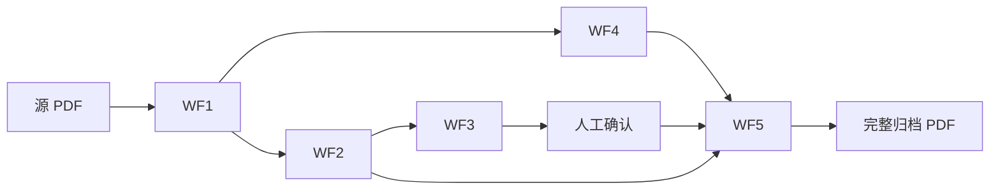

# V4 业务工作流（WF1~WF5）

> 与工程 Phase（T-xxx）双层管理：本文件描述**业务链路**；[`PRD_V4.md`](PRD_V4.md) 第 8 章描述**工程任务**。
> Loop 触发见 [`LOOP_PROMPT.md`](LOOP_PROMPT.md)。

## 总览



| WF | 名称 | 输入 | 输出 | 核心模块 |
|----|------|------|------|----------|
| WF1 | 统一摄入 OCR | PDF 路径 | `OcrDocumentResult`（`full_text` + `page_texts[]`） | `ocr_pipeline.ingest_pdf` |
| WF2 | 文书切分 | `page_texts` + 可选全文/layout | `List[DocumentUnit]` | `pdf_doc_locator.segment_by_catalog` |
| WF3 | 目录映射与缺失 | DocumentUnit + catalog | `catalog_seq`、`missing_items` | `assign_catalog_seq`、`compute_found_seqs` |
| WF4 | 系统表生成 | 全文（可选） | 5 份 docx 路径 | `generate_system_templates` |
| WF5 | 拼装输出 | units + templates + supplements | 完整 PDF + 页守恒 | `pdf_archive_merger.build_full_archive` |

**人工闸门**：WF3 之后、`assemble_archive` 之前（GUI 缺失对话框 / CLI `--skip-missing`）。

## WF1 统一摄入（消除双 OCR）

**原则**：每个源 PDF **至多一次**重型 OCR（MinerU/Baidu）；页级 RapidOCR 仅作空页 fallback。

| 步骤 | 行为 |
|------|------|
| 1 | fitz 逐页文字层；若整卷足够 → `source=text_layer`，`ocr_calls=0` |
| 2 | 否则 MinerU/Baidu 全文一次 → `ocr_calls=1` |
| 3 | 从 MinerU `content_list.json` 还原 `page_texts`（layout） |
| 4 | 仍空页 → RapidOCR 单页 fallback（按页计数） |

**路径 A/B**：`build_units_from_sources` 消费 WF1 的 `page_texts_by_path`，**不再**内部调用 `page_ocr.get_page_texts` 全卷扫描。

## WF2 文书切分（DocumentUnit）

- 粒度：**整份文书**（连续页段），文书内页序不可打乱（D14）。
- 首页锚点定起点 → 中间页并入前一份文书。
- 全文 OCR 补漏起点（`_enrich_starts_from_fulltext`）。
- MinerU layout 标题块补起点（`_enrich_starts_from_layout`）。

## WF3~WF5

与 PRD 第 2 章一致：`analyze_archive` = WF1+2+3+4；`assemble_archive` = WF5。

## 工程 Phase 映射（Phase E~I）

| Phase | 工作流 | 完成判据 |
|-------|--------|----------|
| **E** | WF1 统一 OCR | 80 页卷 `ocr_engine_calls` ≤ 1（无全卷 RapidOCR） | ✅ T-501~504 |
| **F** | WF2+3 | 兴泰贸易 units 覆盖 80 页 | ✅ T-601~605 |
| **G** | WF4 隔离 | 无 Word 时 WF2/3 仍成功 | ✅ T-701~702 |
| **H** | WF5 + 人工闸门 | GUI 两阶段 + 80/80 页守恒 | ✅ T-801~805 |
| **I** | 路径 B + 性能 | `scripts/perf_wf_baseline.py` 基线 | ✅ T-901~902 |
| **J** | 排序与识别准确度 | `scripts/verify_doc_order.py` 无乱序、同槽页序 | ✅ T-1001~1005 |
| **K** | 归档顺序配置化 | `scripts/verify_order_mode.py` catalog/original 均守恒 | ✅ T-1101~1104 |
| **L** | GUI 体验 | 进度条/手动调序/多文件补充/V4 版本 | ✅ T-1201~1204 |
| **M** | CLI 完善 | `scripts/verify_cli_supplement.py` `--supplement`/`--order-mode` | ✅ T-1301~1302 |
| **N** | 工程质量 | `py -m pytest tests/ -q` + CI | ✅ T-1401~1403 |

## 性能基线

```bash
py scripts/perf_wf_baseline.py
```

输出：`outputs/wf_baseline.json`（耗时、OCR 次数、页覆盖）。

## Loop 挂钩

每轮只做 **一个 Phase E~I 任务**（或 PRD T-xxx），verify 后勾选，清上下文，发 [`LOOP_PROMPT.md`](LOOP_PROMPT.md) 恢复语。
